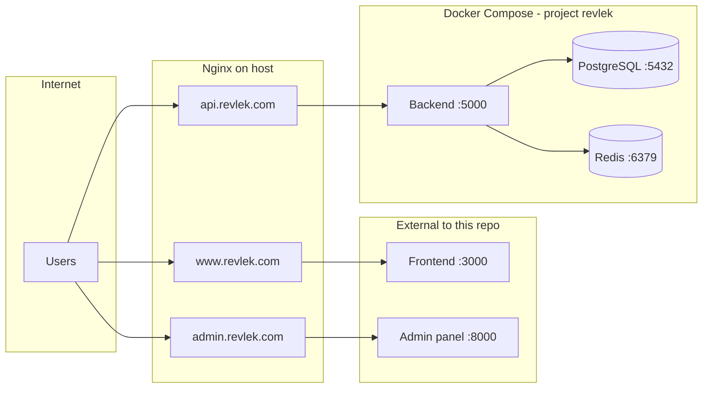

# REVLEK — Server Orchestration

Infrastructure and deployment configuration for the Revlek production server. This repository orchestrates **PostgreSQL**, **Redis**, and the **backend API** via Docker Compose, and provides **Nginx** reverse-proxy configs for all public domains.

This repo does **not** contain application source code. The public website frontend (`:3000`) and admin panel (`:8000`) are deployed separately on the host and are only referenced by the Nginx configs here.

## Architecture



| Component | Image / location | Port |
|-----------|------------------|------|
| Backend API | `ghcr.io/mmxniloy/revlek-website-backend:latest` | 5000 |
| PostgreSQL | `postgres:18.4-trixie` | 5432 |
| Redis | `redis:8.8.0-trixie` | 6379 |
| Frontend | Deployed outside this repo | 3000 |
| Admin panel | Deployed outside this repo | 8000 |

Docker Compose project name: **`revlek`**

## Prerequisites

- Linux server with **root** or **sudo** access
- [Docker Engine](https://docs.docker.com/engine/install/) with Docker Compose v2 (`docker compose`)
- [Nginx](https://nginx.org/) installed and managed via systemd
- DNS **A records** for `revlek.com`, `www.revlek.com`, `api.revlek.com`, and `admin.revlek.com` pointing at the host
- Frontend (`:3000`) and admin panel (`:8000`) running on the host before enabling Nginx sites

> **TLS/SSL:** The site configs in `nginx/sites-available/` are HTTP-only `server` blocks. Add TLS separately on the host (e.g. [Certbot](https://certbot.eff.org/) / Let's Encrypt) or terminate SSL at a load balancer.

## Repository layout

| Path | Purpose |
|------|---------|
| [`docker-compose.yml`](./docker-compose.yml) | Service definitions (pg, redis, backend) |
| [`redeploy.sh`](./redeploy.sh) | Pull latest images, restart containers, prune unused images |
| [`.revlek/.pg.example.env`](./.revlek/.pg.example.env) | PostgreSQL environment template |
| [`.revlek/.backend.example.env`](./.revlek/.backend.example.env) | Backend environment template |
| [`nginx/sites-available/`](./nginx/sites-available/) | Per-domain reverse-proxy configs |
| [`nginx/enable-sites.sh`](./nginx/enable-sites.sh) | Install and enable Nginx sites on the host |

Do **not** commit real `.env` files. Copy the example files and edit them locally:

- `.revlek/.pg.env`
- `.revlek/.backend.env`

## Initial setup

### 1. Clone the repository

```bash
git clone <repo-url> revlek-orchestration
cd revlek-orchestration
```

### 2. Create environment files

```bash
cp .revlek/.pg.example.env .revlek/.pg.env
cp .revlek/.backend.example.env .revlek/.backend.env
```

Edit both files with production values. **All secrets must be changed before going live.**

### 3. Configure PostgreSQL (`.revlek/.pg.env`)

The official Postgres image expects these variables:

| Variable | Description |
|----------|-------------|
| `POSTGRES_USER` | Database superuser |
| `POSTGRES_PASSWORD` | Database password |
| `POSTGRES_DB` | Database name |

> The example file uses `POSTGRES_NAME`, which the Postgres image does **not** recognize. Rename it to `POSTGRES_DB` in your `.pg.env`.

Example:

```env
POSTGRES_USER=revlek
POSTGRES_PASSWORD=<strong-password>
POSTGRES_DB=revlek_website_backend
```

### 4. Configure backend (`.revlek/.backend.env`)

When the backend runs inside Docker Compose, use **Docker service names** as hosts — not `localhost`.

| Variable | Docker Compose value | Local dev (outside Docker) |
|----------|----------------------|----------------------------|
| `DATABASE_URL` | `postgresql://<user>:<password>@pg:5432/<db>` | `postgresql://<user>:<password>@localhost:5432/<db>` |
| `REDIS_HOST` | `redis` | `localhost` |

Ensure the user, password, and database name in `DATABASE_URL` match `.pg.env`.

Example for production (Docker):

```env
NODE_ENV=production
DATABASE_URL=postgresql://revlek:<password>@pg:5432/revlek_website_backend
REDIS_HOST=redis
REDIS_PORT=6379
```

Set `SITE_URL`, `ADMIN_PANEL_URL`, and `EMAIL_LOGO_URL` to your public URLs. Configure Nodemailer and Cloudflare Turnstile with real credentials (the example Turnstile keys are test keys only).

### 5. Start Docker services

From the repository root:

```bash
chmod +x redeploy.sh
./redeploy.sh
```

### 6. Enable Nginx sites

Ensure frontend (`:3000`) and admin (`:8000`) are already listening on the host, then:

```bash
cd nginx
chmod +x enable-sites.sh
./enable-sites.sh
```

The script must be run from the `nginx/` directory — it resolves `sites-available/` relative to the current working directory.

## Docker services

Defined in [`docker-compose.yml`](./docker-compose.yml):

| Service | Container | Image | Host port | Volume | Networks |
|---------|-----------|-------|-----------|--------|----------|
| `pg` | `revlek-pg` | `postgres:18.4-trixie` | 5432 | `pg-data` → `/var/lib/postgresql` | `pg-net` |
| `redis` | `revlek-redis` | `redis:8.8.0-trixie` | 6379 | `redis-data` → `/data` | `redis-net` |
| `backend` | `revlek-backend` | `ghcr.io/mmxniloy/revlek-website-backend:latest` | 5000 | `backend-data` → `/usr/src/app/uploads` | `backend-net`, `pg-net`, `redis-net` |

The backend depends on `pg` and `redis`. Uploads are persisted in the `backend-data` volume.

### Useful commands

```bash
# Service status
docker compose -f docker-compose.yml -p revlek ps

# Follow logs
docker compose -f docker-compose.yml -p revlek logs -f backend
docker compose -f docker-compose.yml -p revlek logs -f pg
docker compose -f docker-compose.yml -p revlek logs -f redis

# Stop all services
docker compose -f docker-compose.yml -p revlek down

# Stop and remove volumes (destructive — deletes data)
docker compose -f docker-compose.yml -p revlek down -v
```

## Scripts

### [`redeploy.sh`](./redeploy.sh)

Pulls the latest images, restarts containers, and prunes unused images. Exits immediately on any error (`set -e`).

| Step | Action |
|------|--------|
| 1 | Uses project name `revlek` |
| 2 | `docker compose pull` |
| 3 | `docker compose up -d --build` |
| 4 | `docker image prune -f` |

```bash
./redeploy.sh
```

### [`nginx/enable-sites.sh`](./nginx/enable-sites.sh)

Installs Nginx site configs on the host. Requires **sudo**.

| Step | Action |
|------|--------|
| 1 | Verifies `nginx` is available |
| 2 | Copies `www.revlek.com`, `api.revlek.com`, and `admin.revlek.com` from `sites-available/` to `/etc/nginx/sites-available/` |
| 3 | Creates symlinks in `/etc/nginx/sites-enabled/` |
| 4 | Runs `nginx -t` — on failure, **rolls back** symlinks and copied files, then exits |
| 5 | On success, runs `systemctl restart nginx` |

```bash
cd nginx
./enable-sites.sh
```

## Nginx routing

| Domain | Upstream | Managed by |
|--------|----------|------------|
| `revlek.com` / `www.revlek.com` | `127.0.0.1:3000` | External frontend |
| `api.revlek.com` | `127.0.0.1:5000` | Docker backend |
| `admin.revlek.com` | `127.0.0.1:8000` | External admin app |

All site configs share these proxy settings:

- 180s read/connect/send timeouts
- `client_max_body_size 100M`
- Standard forwarded headers (`Host`, `X-Real-IP`, `X-Forwarded-For`)

## Environment variables

### PostgreSQL — `.revlek/.pg.env`

| Variable | Required | Description |
|----------|----------|-------------|
| `POSTGRES_USER` | Yes | Database user |
| `POSTGRES_PASSWORD` | Yes | Database password — **change in production** |
| `POSTGRES_DB` | Yes | Database name |

### Backend — `.revlek/.backend.env`

Variables are grouped below. See [`.revlek/.backend.example.env`](./.revlek/.backend.example.env) for the full template.

#### Application

| Variable | Default | Description |
|----------|---------|-------------|
| `PORT` | `5000` | HTTP listen port |
| `NODE_ENV` | `development` | Set to `production` on the server |

#### Database

| Variable | Description |
|----------|-------------|
| `DATABASE_URL` | PostgreSQL connection string — use host `pg` inside Docker |
| `PG_POOL_MAX` | Max connections in the pool |
| `PG_IDLE_TIMEOUT` | Idle connection timeout (ms) |
| `PG_CONNECTION_TIMEOUT` | Connection timeout (ms) |

#### Redis and BullMQ

| Variable | Description |
|----------|-------------|
| `REDIS_NAMESPACE` | Key namespace prefix |
| `REDIS_HOST` | Redis host — use `redis` inside Docker |
| `REDIS_PORT` | Redis port |
| `REDIS_USERNAME` | Redis username (if auth enabled) |
| `REDIS_PASSWORD` | Redis password (if auth enabled) |
| `REDIS_DATABASE` | Redis DB index for cache |
| `CACHE_TTL_SECONDS` | Default cache TTL |
| `BULLMQ_DATABASE` | Redis DB index for job queues |
| `BULLMQ_PREFIX` | BullMQ key prefix |

#### JWT, cookies, and auth

| Variable | Description |
|----------|-------------|
| `JWT_ACCESS_TOKEN_COOKIE_NAME` | Access token cookie name |
| `JWT_SECRET` | Access token signing secret — **change in production** |
| `JWT_EXPIRATION_TIME_MS` | Access token lifetime (ms) |
| `JWT_REFRESH_TOKEN_SECRET` | Refresh token signing secret — **change in production** |
| `JWT_REFRESH_TOKEN_COOKIE_NAME` | Refresh token cookie name |
| `JWT_REFRESH_TOKEN_EXPIRATION_TIME_MS` | Refresh token lifetime (ms) |
| `COOKIE_SECRETS` | Comma-separated cookie signing secrets — **change in production** |
| `BCRYPT_SALT_ROUNDS` | bcrypt cost factor |
| `MAX_LOGIN_ATTEMPTS` | Failed logins before lockout |
| `LOCKOUT_DURATION_MS` | Account lockout duration (ms) |

#### Nodemailer

| Variable | Description |
|----------|-------------|
| `NODEMAILER_USER` | SMTP username |
| `NODEMAILER_PASS` | SMTP password |
| `NODEMAILER_HOST` | SMTP host |
| `NODEMAILER_USER_FROM` | From address |
| `ADMIN_EMAIL` | Admin notification recipient |
| `NODEMAILER_SECURE` | Use TLS (`true`/`false`) |
| `NODEMAILER_POOL` | Enable connection pooling |
| `NODEMAILER_MAX_CONNECTIONS` | Max SMTP connections |
| `NODEMAILER_MAX_MESSAGES` | Max messages per connection |

#### Swagger

| Variable | Description |
|----------|-------------|
| `SWAGGER_TITLE` | API docs title |
| `SWAGGER_DESCRIPTION` | API docs description |
| `SWAGGER_VERSION` | API docs version string |

#### Uploads and job applications

| Variable | Description |
|----------|-------------|
| `UPLOAD_DIR` | Upload directory name |
| `JOB_RESUME_MAX_MB` | Max resume file size (MB) |
| `JOB_SUPPORTING_MAX_MB` | Max supporting document size (MB) |
| `JOB_SUPPORTING_MAX_COUNT` | Max supporting documents per application |
| `JOB_RESUME_MIME_TYPES` | Allowed resume MIME types |
| `JOB_SUPPORTING_MIME_TYPES` | Allowed supporting document MIME types |
| `JOB_APPLY_THROTTLE_TTL_MS` | Rate-limit window for job applications (ms) |
| `JOB_APPLY_THROTTLE_LIMIT` | Max applications per window |

#### Cloudflare Turnstile

| Variable | Description |
|----------|-------------|
| `TURNSTILE_SECRET_KEY` | Server-side secret — **replace test keys in production** |
| `TURNSTILE_SITE_KEY` | Client-side site key — **replace test keys in production** |

#### URLs

| Variable | Description |
|----------|-------------|
| `ADMIN_PANEL_URL` | Admin panel base URL (used in email links) |
| `SITE_URL` | Public website URL |
| `EMAIL_LOGO_URL` | Logo URL for transactional emails |

## Operations

### Redeploy after an image update

```bash
./redeploy.sh
```

### View logs

```bash
docker compose -f docker-compose.yml -p revlek logs -f <service>
```

Replace `<service>` with `backend`, `pg`, or `redis`.

### Backups

Persistent data lives in Docker named volumes:

| Volume | Data |
|--------|------|
| `pg-data` | PostgreSQL database files |
| `redis-data` | Redis persistence |
| `backend-data` | Uploaded files (`/usr/src/app/uploads`) |

Back up these volumes regularly. For PostgreSQL, prefer logical dumps in addition to volume snapshots:

```bash
docker exec revlek-pg pg_dump -U <user> <database> > backup.sql
```

### Restart Nginx after manual config edits

```bash
sudo nginx -t && sudo systemctl restart nginx
```

## Troubleshooting

### `nginx -t` fails after `enable-sites.sh`

The script automatically removes symlinks and copied files on failure. Common causes:

- Syntax error in a site config
- Port conflict with another Nginx `server` block
- Missing `sites-available/` file (script skips missing files)

### Backend cannot connect to PostgreSQL or Redis

- Verify `DATABASE_URL` uses host **`pg`**, not `localhost`
- Verify `REDIS_HOST` is **`redis`**, not `localhost`
- Confirm credentials match `.pg.env`
- Check container health: `docker compose -f docker-compose.yml -p revlek ps`

### Nginx returns 502 Bad Gateway

- Confirm the upstream is listening on the expected port:
  - Frontend: `3000`
  - Backend: `5000`
  - Admin: `8000`
- Test locally: `curl -I http://127.0.0.1:5000`

### Cannot pull backend image from GHCR

If the image is private, authenticate before running `redeploy.sh`:

```bash
echo <token> | docker login ghcr.io -u <username> --password-stdin
```

### Containers exit immediately

```bash
docker compose -f docker-compose.yml -p revlek logs <service>
```

Check for missing or invalid values in `.revlek/.pg.env` or `.revlek/.backend.env`.
